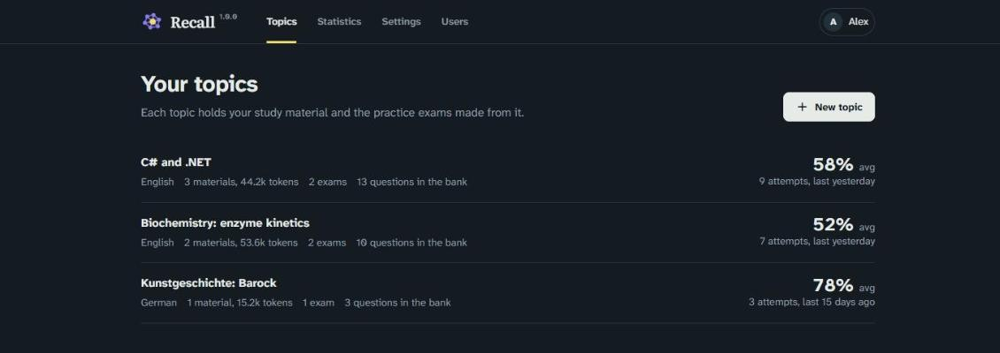
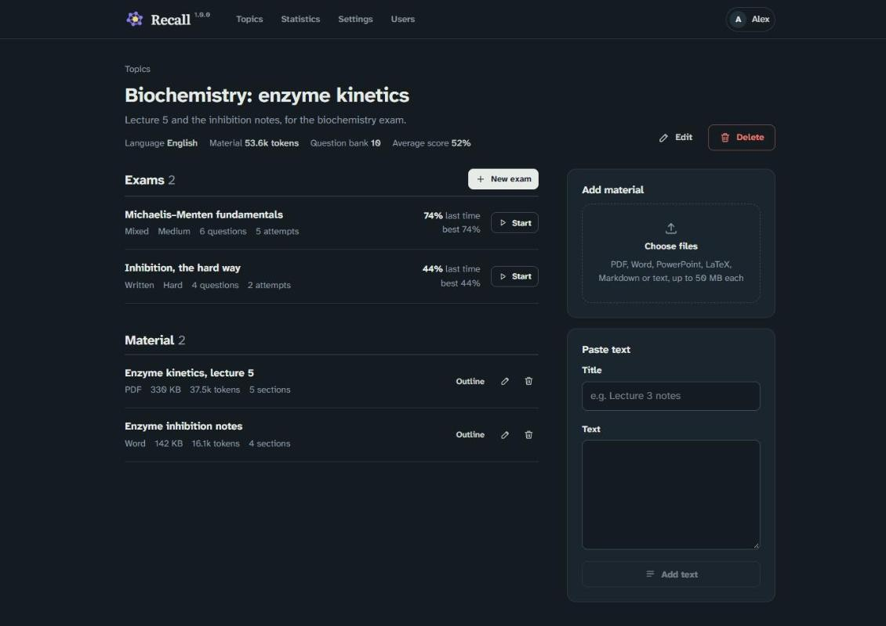
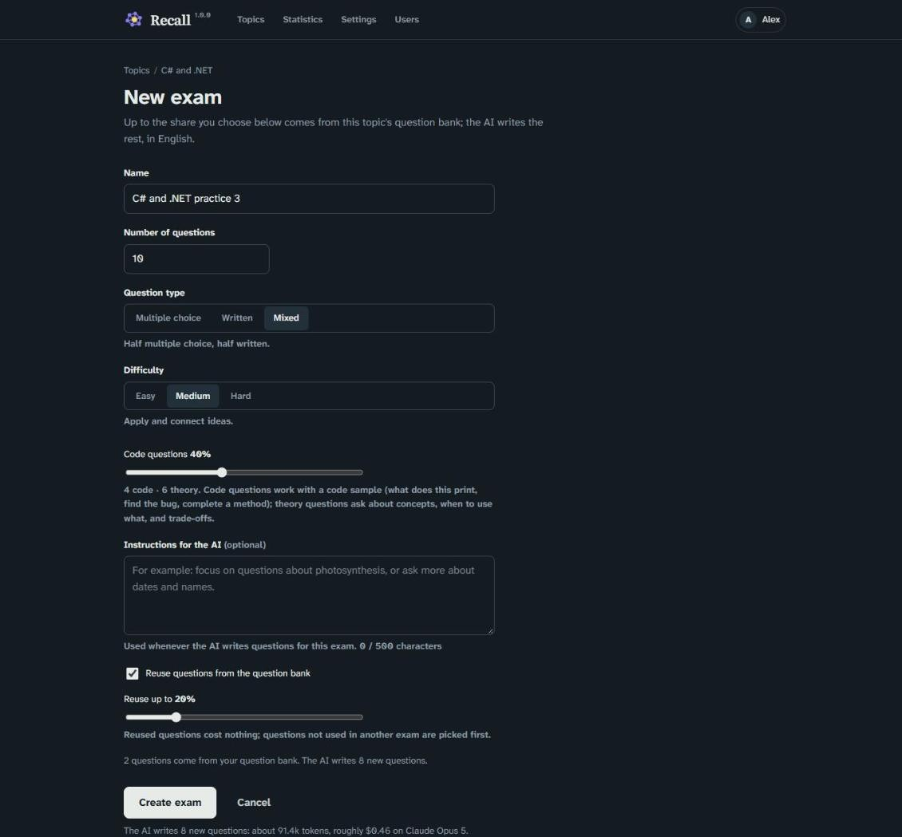
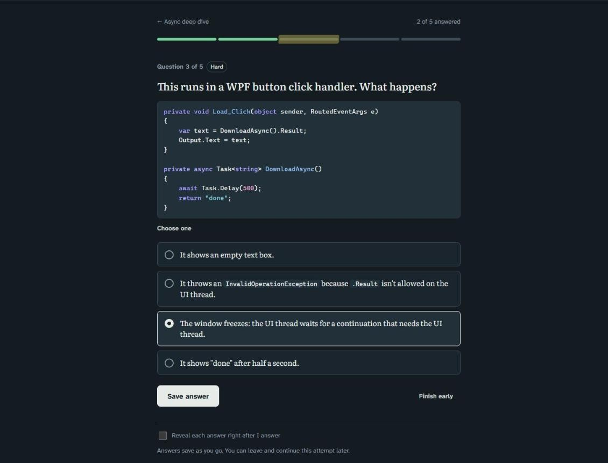
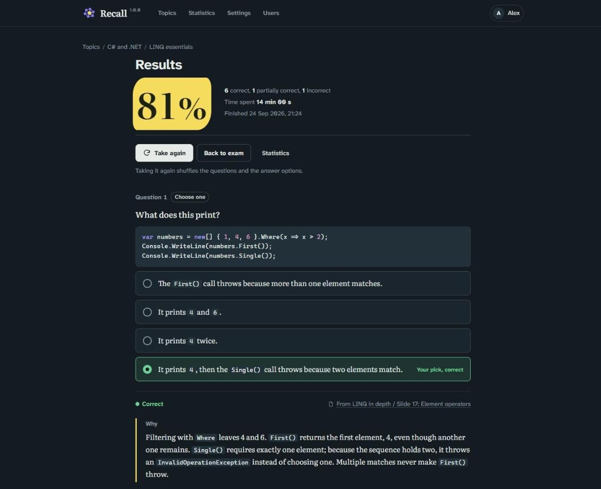
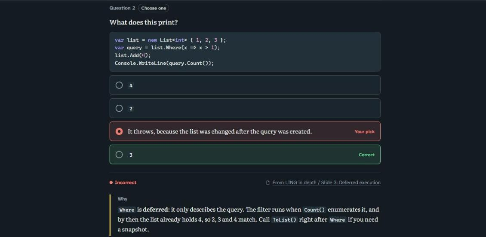
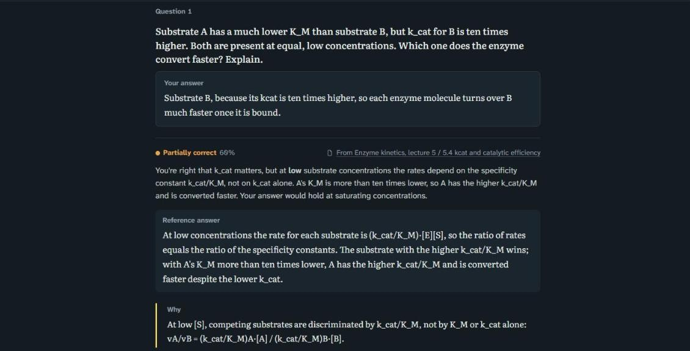
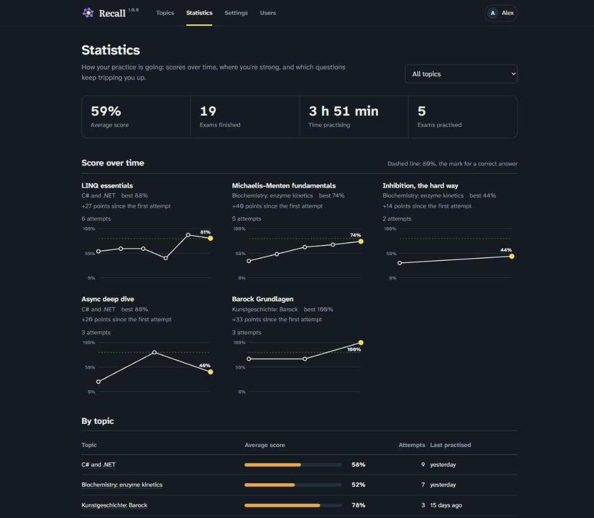
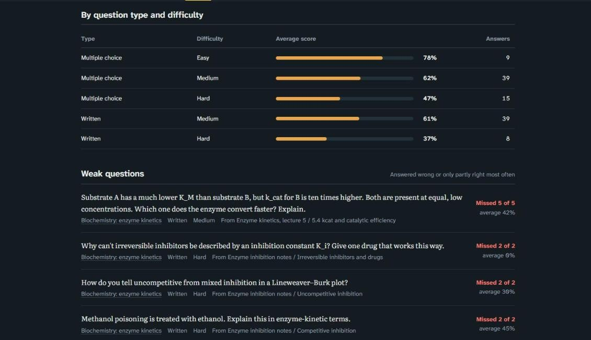
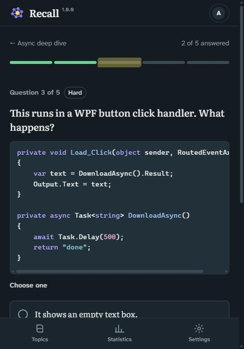

# Recall


**Recall turns your own notes, slides and scripts into practice exams, and explains every answer
so you actually learn from it.**

Bring a lecture PDF, a slide deck or a page of notes. Recall writes questions in your topic's
language, grades your written answers with specific feedback, and shows where you're improving
and what still trips you up. It runs on your own server, with your own AI key, so your material
stays yours.

- **Learn, don't just score.** Every answer comes with a thorough explanation and a link to the
  part of your material it came from
- **Built for technical subjects too.** Programming topics mix real code questions with theory
- **Private by design.** Self-hosted, one account per person, nothing shared
- **No surprise bills.** You see the expected cost before the AI writes anything

## Topics and material

Everything starts with a topic: a course, a subject, an exam you're preparing for. It holds any
amount of study material:

- Upload **PDF, Word (.docx), PowerPoint (.pptx), LaTeX or Markdown** files, or paste text in
  directly. PowerPoint slides come in one section per slide, speaker notes included
- Each material's text is extracted once and outlined by the AI, so later requests only send
  what's needed
- The token count is shown on each material and topic, so you can see what the AI will read
- A topic can be in any language. Questions, answers, explanations and grading use that
  language, while the app itself stays in English
- Mark a topic as a **programming topic**, and its exams mix code questions (what does this
  print, find the bug, complete a method) with theory





## Exams

Turn a topic into as many exams as you like: pick a name, a question count, the type (multiple
choice, written, or a mix) and the difficulty (easy, medium or hard). Optionally, give the AI
instructions such as "focus on dates and names". Exams in a programming topic also set how many
questions work with code (40% by default); the rest are theory.

- **Multiple choice** questions say clearly whether there's one right answer or several
- **Written** answers are short (a few sentences, not an essay). The AI scores them from 0 to
  100% and explains what was right and what was missing
- Reveal each answer right away or wait until the end. Every answer comes with a thorough
  explanation and a link to the part of the material it came from
- There's no timer, but every attempt's duration is recorded. Answers are saved as you go, so you
  can leave and resume an attempt later
- Repeat an exam as often as you like, with the question order and the options shuffled
- Amend an exam later: edit its settings, remove or replace a question, edit a question by hand,
  or add your own





Code shows up as code, with syntax colouring, in questions, options, answers and explanations.
After each question, or at the end, you see what was right, what you picked, and why:







## Question bank

Nothing gets thrown away. Every generated question is kept in the topic's bank and can be reused
by later exams, which costs nothing. Each exam chooses how much to reuse (20% by default), so
practice stays mostly fresh. Reused questions match the exam's type, difficulty and code/theory
mix. New questions are checked against the bank, and repeats are dropped. When a topic's bank
gets close to what its material can support, Recall tells you.

## Statistics

See what's sticking and what isn't:

- Score over time for each exam
- An overview per topic: average score, attempt count, last practised
- Weak questions: the ones you get wrong most often
- A breakdown by question type and difficulty





## On a phone

Recall is made for a computer, but works on tablets and phones too.



## AI and costs

Each user brings their own **Claude or ChatGPT API key**, set in Settings. Keys are stored
encrypted and never sent to the browser. There's no shared key, and usage is billed to that
user's own account.

Because it's your money, Recall shows the expected tokens and cost for your chosen model next to
anything that costs noticeably, and asks before an unusually large generation. When a topic fits
the model's budget it is sent whole and cached, so follow-up requests are cheap. Larger topics are
worked through section by section.

## Accounts and email

There's no public sign-up. The first person to open a new installation creates the
administrator account, and after that only the admin creates accounts. Each person's topics and
results are private.

The admin sets up outgoing email under **Admin → Email settings** (any SMTP server, with
shortcuts for Gmail and Brevo). With email set up:

- New users get an **invite link** to choose their own password
- **Forgot password?** on the sign-in page sends a reset link

Without email, the admin gets the same links on the Users page to pass on by hand.

After an update, everyone sees a short "What's new" banner linking to the release notes, until
they close it.

## With Docker

Using docker compose:

```yaml
services:
  recall:
    image: ghcr.io/geeforceone/recall:latest
    container_name: recall
    ports:
      - 8080:8080
    volumes:
      - recall-data:/data
    restart: unless-stopped

volumes:
  recall-data:
```

or docker run:

```bash
docker run -d --name recall \
  -p 8080:8080 \
  -v recall-data:/data \
  --restart unless-stopped \
  ghcr.io/geeforceone/recall:latest
```

Then open http://localhost:8080 and create the admin account.

Everything that needs to persist lives in one volume mounted at `/data`: the SQLite database,
uploaded files, and the encryption keys that protect stored API keys and the SMTP password.
Back up that volume, and don't lose the keys: without them, saved keys have to be entered
again.

Optional settings, as environment variables:

| Variable | Default | Meaning |
|---|---|---|
| `LearningPortal__MaxUploadBytes` | `52428800` (50 MB) | Upload limit per file |
| `LearningPortal__TopicTokenBudget` | `120000` | Topics up to this size are sent whole; larger ones section by section |
| `LearningPortal__LargeGenerationWarnCost` | `1.00` | Ask before a generation or analysis whose material would cost more than this many US dollars on the chosen model |
| `LearningPortal__LargeGenerationWarnTokens` | `60000` | The same, in tokens, for a custom model ID with no known price |
| `Storage__DataDirectory` | `/data` | Where the database, files and keys are kept |

If you run it behind a reverse proxy under its own address, enter that address in
**Admin → Email settings** so links in emails point to it.

## Build from source instead

```
git clone https://github.com/geeForceOne/LearningPortal.git
cd LearningPortal
docker build -t recall .
docker run -d --name recall -p 8080:8080 -v recall-data:/data recall
```

The repository's own `docker-compose.yml` does the same with `docker compose up -d --build`.

## Development

```
dotnet build LearningPortal.slnx              # build everything
dotnet run --project src/LearningPortal.Web   # run locally
```

Built with .NET 10 and Blazor Server. See `CLAUDE.md` for the architecture.

## About this project

This project was developed entirely by [Claude Code](https://claude.com/claude-code), Anthropic's
AI coding agent. It is provided as-is, without warranty of any kind, express or implied. The
author accepts no responsibility or liability for any loss, damage, or costs arising from its
use, including charges from AI providers. Use at your own risk.

## License

Released under the [MIT License](LICENSE).
