# Recall

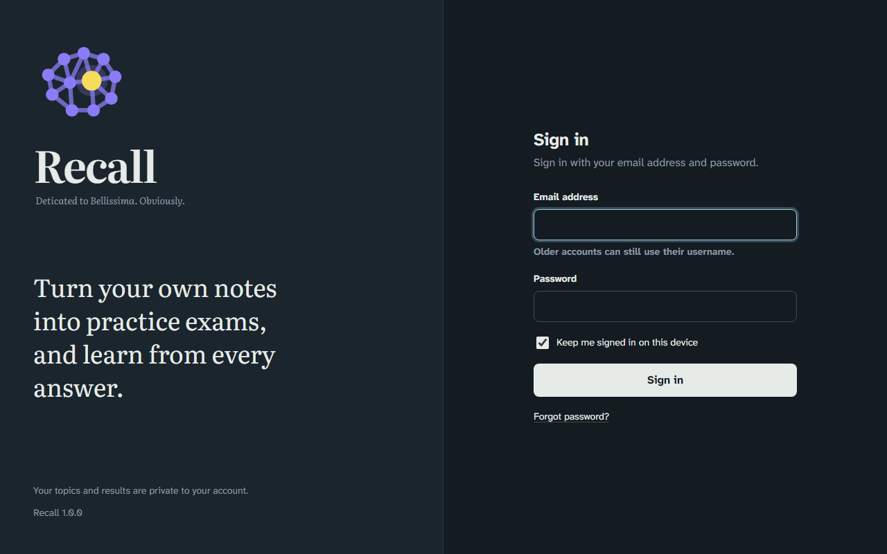

**Recall turns your own notes, slides and scripts into practice exams, and explains every answer
so you actually learn from it.**

Bring a lecture PDF, a slide deck or a page of notes. Recall writes questions in your topic's
language, grades your written answers with specific feedback, and shows where you're improving
and what still trips you up. It runs on your own server, with your own AI key, so your material
stays yours.

- **Learn, don't just score.** Every answer comes with a thorough explanation and a link to the
  part of your material it came from
- **Built for technical subjects too.** Programming topics mix real code questions with theory
- **Private by design.** Self-hosted, one account per person, nothing shared
- **No surprise bills.** You see the expected cost before the AI writes anything

## Topics and material

Everything starts with a topic: a course, a subject, an exam you're preparing for. It holds any
amount of study material:

- Upload **PDF, Word (.docx), PowerPoint (.pptx), LaTeX or Markdown** files, or paste text in
  directly. PowerPoint slides come in one section per slide, speaker notes included
- Each material's text is extracted once and outlined by the AI, so later requests only send
  what's needed
- The token count is shown on each material and topic, so you can see what the AI will read
- A topic can be in any language. Questions, answers, explanations and grading use that
  language, while the app itself stays in English
- Mark a topic as a **programming topic**, and its exams mix code questions (what does this
  print, find the bug, complete a method) with theory

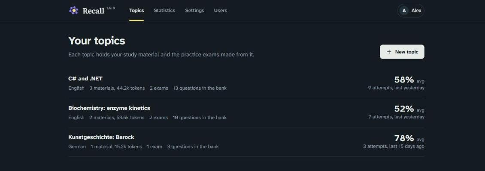

## Exams

Turn a topic into as many exams as you like: pick a name, a question count, the type (multiple
choice, written, or a mix) and the difficulty (easy, medium or hard). Optionally, give the AI
instructions such as "focus on dates and names". Exams in a programming topic also set how many
questions work with code (40% by default); the rest are theory.

- **Multiple choice** questions say clearly whether there's one right answer or several
- **Written** answers are short (a few sentences, not an essay). The AI scores them from 0 to
  100% and explains what was right and what was missing
- Reveal each answer right away or wait until the end. Every answer comes with a thorough
  explanation and a link to the part of the material it came from
- Still unsure? **Ask the AI a follow-up** about a revealed answer ("why isn't B right?"), up to
  three per question. The replies are saved with the attempt
- There's no timer, but every attempt's duration is recorded. Answers are saved as you go, so you
  can leave and resume an attempt later
- Repeat an exam as often as you like, with the question order and the options shuffled
- Amend an exam later: edit its settings, remove or replace a question, edit a question by hand,
  or add your own
- Questions are written in the background: leave the page or close the browser, and they're there
  when you come back

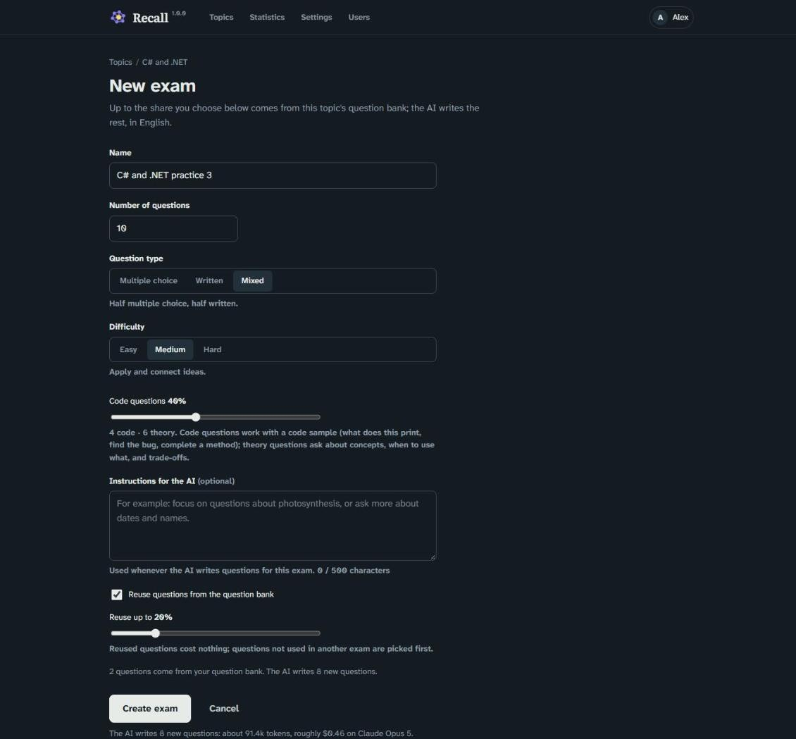

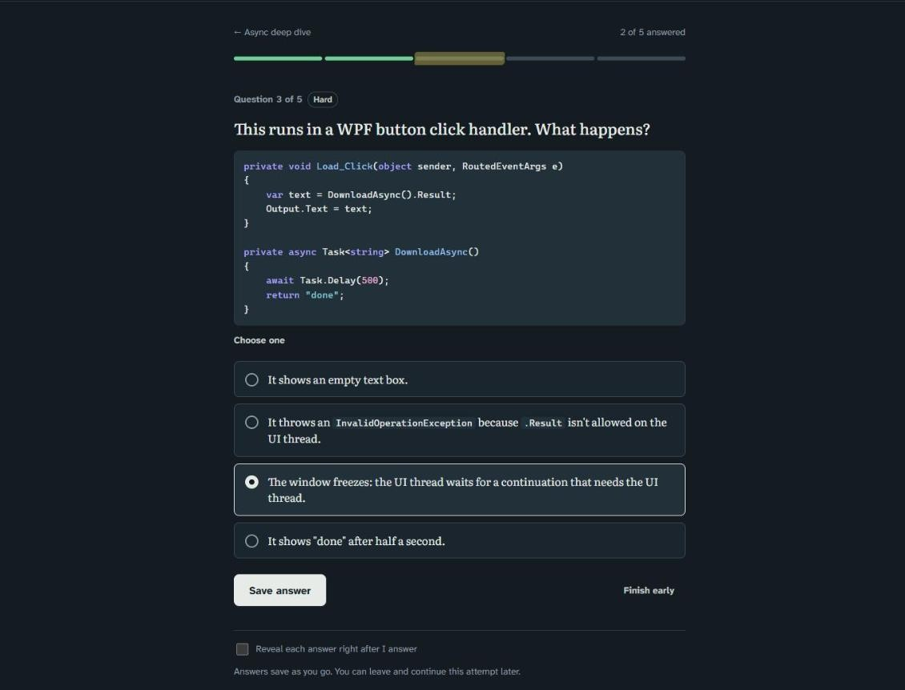

Code shows up as code, with syntax colouring, in questions, options, answers and explanations.
After each question, or at the end, you see what was right, what you picked, and why:

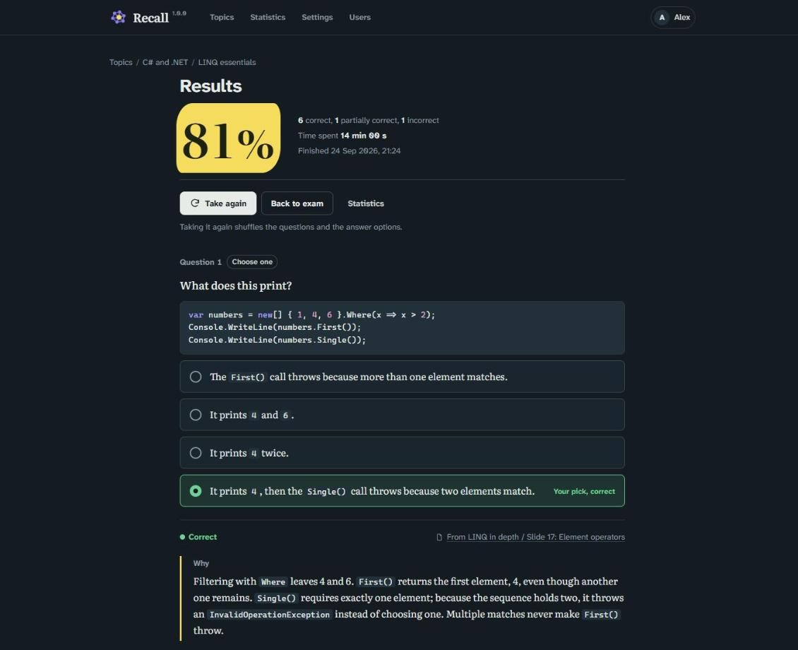

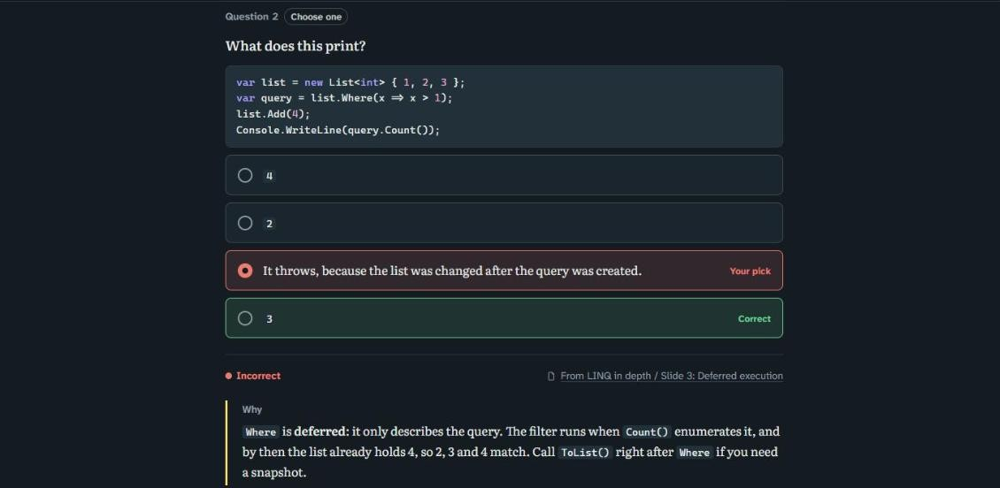

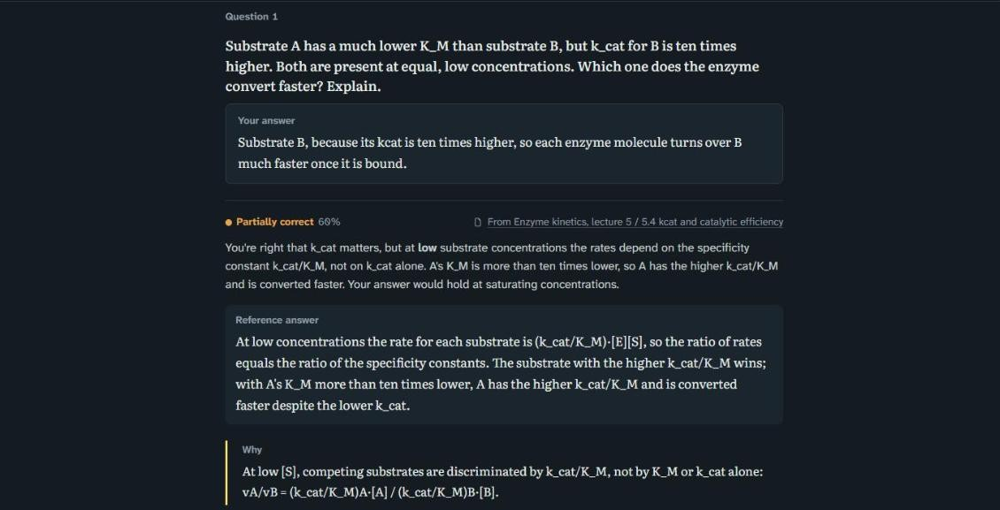

## Go deeper

Exams test what you know. The **Go deeper** section on each topic page helps you understand it:
four tools, side by side, between the exams and the material.

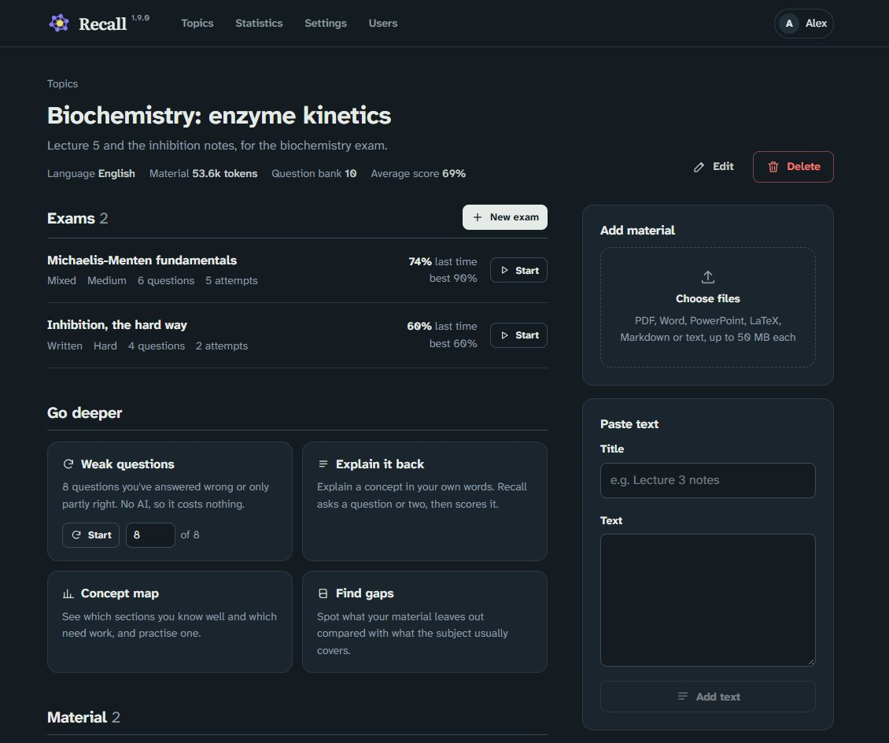

### Weak questions

Practise exactly the questions you've answered wrong or only partly right in this topic, most
missed first (10 by default, adjustable). No AI is involved, so it costs nothing. Keep a practice
run as an exam if it's useful.

### Explain it back

The best test of understanding is explaining something in your own words. Pick a concept from
your material, or press **Surprise me** and Recall picks one you're weak in or haven't practised.
Write your explanation as if to someone new to the subject.

Recall then asks one or two questions like a curious student would: about what was unclear,
missing or not quite right. Answer them, and you get a score and feedback on what you explained
well and what was missing. Only that part of your material goes to the AI, so it checks you
against your own sources. Your explanations are kept per topic, so you can look back at them.

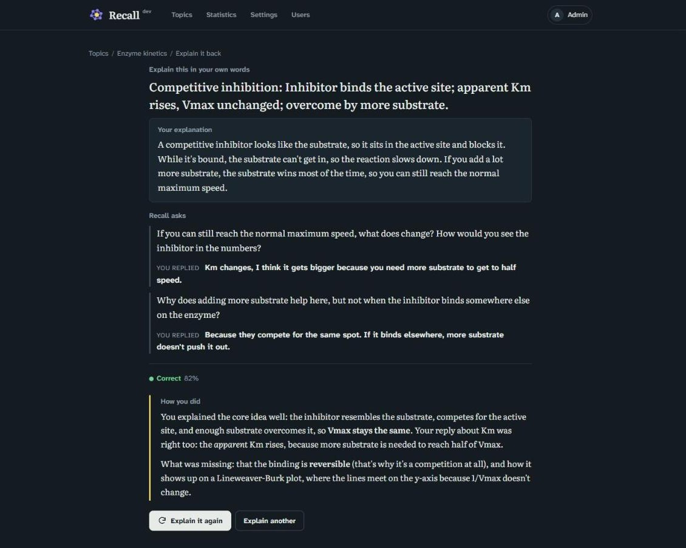

### Concept map

A topic's material, section by section, as tiles: sized by how much text each section has and
coloured by how well you do on the questions written from it (solid, shaky, weak, not practised
yet, or no questions yet). Material without headings, like most PDFs, gets its section names
from the outline Recall made when you uploaded it. Pick a section and practise just that part. The
map uses your results only, so it costs nothing.

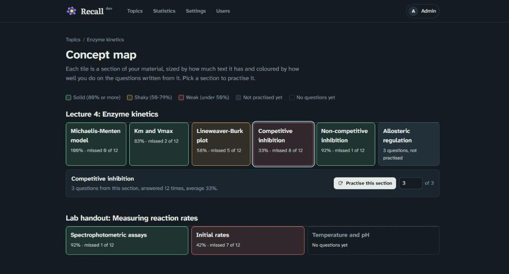

### Find gaps

Your material might not cover everything a course on the topic usually does. **Find gaps**
compares your material with the subject and lists what's missing, with a line on why each part
matters. For each gap, Recall can write a short study note and add it to the topic as material,
so later exams can ask about it too.

This comes from the AI's general knowledge, not from your sources, so it can be wrong. The page
says so, and study notes are marked "Written by the AI · may contain mistakes" wherever they appear.

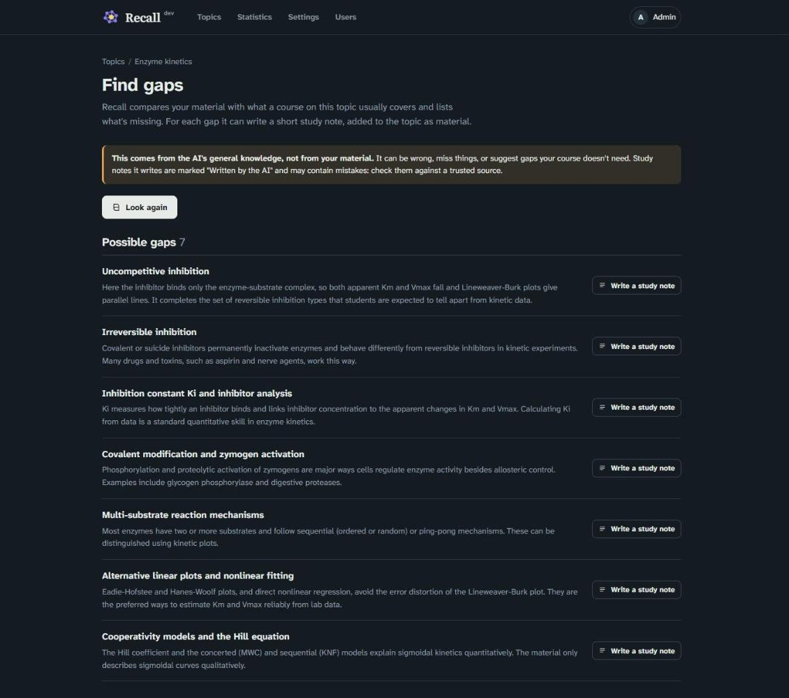

## Question bank

Nothing gets thrown away. Every generated question is kept in the topic's bank and can be reused
by later exams, which costs nothing. Reuse is off by default, so every exam gets freshly written
questions; turn it on per exam and choose how much to reuse. Reused questions match the exam's type, difficulty and code/theory
mix. New questions are checked against the bank, and repeats are dropped. When a topic's bank
gets close to what its material can support, Recall tells you.

## Statistics

See what's sticking and what isn't:

- Score over time for each exam
- An overview per topic: average score, attempt count, last practised
- Weak questions: the ones you get wrong most often, with **Practice weak questions** to drill
  exactly those (also on each topic page under Go deeper)
- A breakdown by question type and difficulty

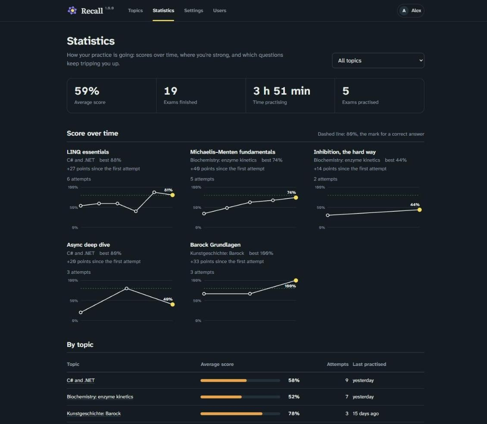

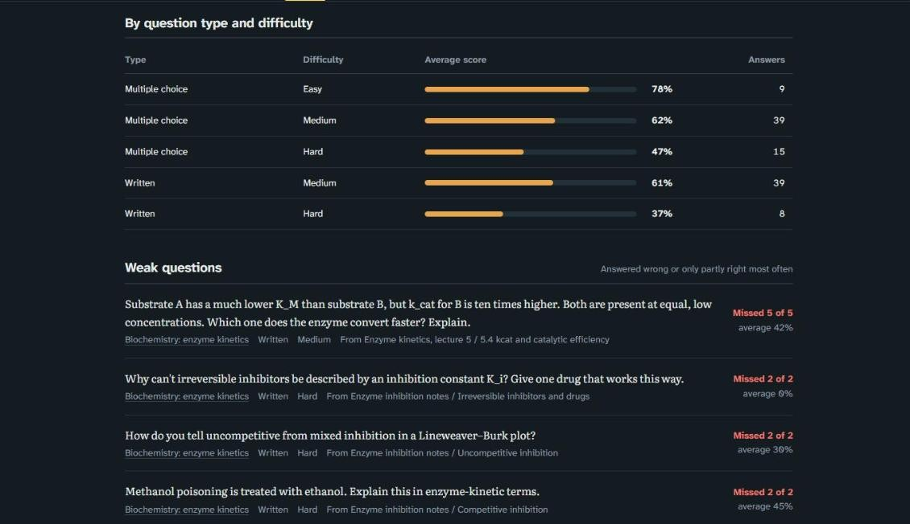

## On a phone

Recall is made for a computer, but works on tablets and phones too, and you can put it on your
home screen like an app (its own icon, full screen, no browser bar):

- **Android:** in Chrome, open the menu and choose **Install app**
- **iPhone and iPad:** in Safari, tap **Share**, then **Add to Home Screen**. Recall shows a short
  hint about this the first time. The home-screen app keeps its own sign-in, so you sign in once
  more there

Installing needs Recall to be reached over **HTTPS**; over plain `http://` you only get a
bookmark-style shortcut. There's no offline mode: like the website, the app needs a connection.

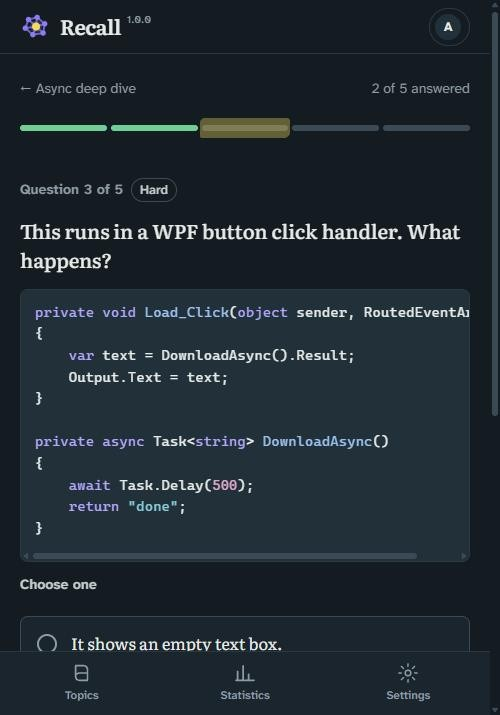

## AI and costs

Each user brings their own **Claude or ChatGPT API key**, set in Settings. Keys are stored
encrypted and never sent to the browser. There's no shared key, and usage is billed to that
user's own account.

Because it's your money, Recall shows the expected tokens and cost for your chosen model next to
anything that costs noticeably, and asks before an unusually large generation. When a topic fits
the model's budget it is sent whole and cached, so follow-up requests are cheap. Larger topics are
worked through section by section.

## Accounts and email

There's no open sign-up. The first person to open a new installation creates the
administrator account, and after that the admin creates accounts. Each person's topics and
results are private.

The admin can also let people **request an account** (Admin settings, off by default, needs
email). The sign-in page then shows "Request an account": people enter their email, their name
and, if they like, a few words about who they are and why they'd like to use Recall. Admins get
an email for each request and approve or decline it on the Users page. Approving sends the usual
invite; declining sends a short email, with an optional note.

The admin sets up outgoing email under **Admin settings** (any SMTP server, with
shortcuts for Gmail and Brevo). With email set up:

- New users get an **invite link** to choose their own password
- **Forgot password?** on the sign-in page sends a reset link

Without email, the admin gets the same links on the Users page to pass on by hand.

After an update, everyone sees a short "What's new" banner linking to the release notes, until
they close it.

## Homepage widget

Recall can show a few numbers on a [Homepage](https://gethomepage.dev) dashboard: the number of
accounts, the people who used Recall in the last 7 days, and those using it right now (the last
10 minutes). An admin creates a token under **Admin settings → Homepage widget**. It's shown once,
there's one for the whole installation, and it can be replaced or turned off there at any time.

```powershell
Invoke-RestMethod http://localhost:8080/api/homepage/stats -Headers @{ 'X-API-Key' = '<token>' }
```

returns

```json
{ "accounts": 12, "activeThisWeek": 7, "activeNow": 2 }
```

In Homepage's `services.yaml`, as a [customapi](https://gethomepage.dev/widgets/services/customapi/) widget:

```yaml
- Recall:
    href: https://learn.example.com
    widget:
      type: customapi
      url: http://recall:8080/api/homepage/stats
      refreshInterval: 60000
      headers:
        X-API-Key: <token>
      mappings:
        - field: accounts
          label: Accounts
          format: number
        - field: activeThisWeek
          label: This week
          format: number
        - field: activeNow
          label: Now
          format: number
```

## With Docker

Using docker compose:

```yaml
services:
  recall:
    image: ghcr.io/geeforceone/recall:latest
    container_name: recall
    ports:
      - 8080:8080
    volumes:
      - recall-data:/data
    restart: unless-stopped

volumes:
  recall-data:
```

or docker run:

```bash
docker run -d --name recall \
  -p 8080:8080 \
  -v recall-data:/data \
  --restart unless-stopped \
  ghcr.io/geeforceone/recall:latest
```

Then open http://localhost:8080 and create the admin account.

Everything that needs to persist lives in one volume mounted at `/data`: the SQLite database,
uploaded files, and the encryption keys that protect stored API keys and the SMTP password.
Back up that volume, and don't lose the keys: without them, saved keys have to be entered
again.

Optional settings, as environment variables:

| Variable | Default | Meaning |
|---|---|---|
| `LearningPortal__MaxUploadBytes` | `52428800` (50 MB) | Upload limit per file |
| `LearningPortal__TopicTokenBudget` | `120000` | Topics up to this size are sent whole; larger ones section by section |
| `LearningPortal__LargeGenerationWarnCost` | `1.00` | Ask before a generation or analysis whose material would cost more than this many US dollars on the chosen model |
| `LearningPortal__LargeGenerationWarnTokens` | `60000` | The same, in tokens, for a custom model ID with no known price |
| `Storage__DataDirectory` | `/data` | Where the database, files and keys are kept |

If you run it behind a reverse proxy under its own address, enter that address in
**Admin settings** so links in emails point to it.

## Build from source instead

```
git clone https://github.com/geeForceOne/LearningPortal.git
cd LearningPortal
docker build -t recall .
docker run -d --name recall -p 8080:8080 -v recall-data:/data recall
```

The repository's own `docker-compose.yml` does the same with `docker compose up -d --build`.

## Development

```
dotnet build LearningPortal.slnx              # build everything
dotnet run --project src/LearningPortal.Web   # run locally
```

Built with .NET 10 and Blazor Server. See `CLAUDE.md` for the architecture.

## About this project

This project was developed entirely by [Claude Code](https://claude.com/claude-code), Anthropic's
AI coding agent. It is provided as-is, without warranty of any kind, express or implied. The
author accepts no responsibility or liability for any loss, damage, or costs arising from its
use, including charges from AI providers. Use at your own risk.

## License

Released under the [MIT License](LICENSE).
